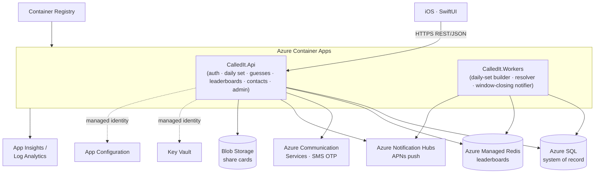

# Called It 🎯

A daily casual-forecasting game. Three binary predictions a day — **Sports**, **Finance**,
**Pop Culture** — dropped to everyone at the same moment with a hard **6-hour lock**. Build
per-category streaks, chase a permanent lifetime score, and climb friends + global leaderboards.

This repository contains the **.NET 10 backend**, **Bicep IaC**, **GitHub Actions CI/CD**,
and a shared **Expo React Native client**, initially served as mobile web alongside the API.
The original SwiftUI scaffold and shared OpenAPI contract remain available.

**Phone-playable TEST:** invite-only, simulated shared two-minute rounds, with explicit
Start/Stop and four-hour automatic expiry. Accounts/results survive Stop in private Azure SQL;
disposable compute/network/registry resources do not. SQL and disposable workloads use
**Central US**; existing keys, identities, and shutdown controls remain in **East US 2**.
Budget roughly **$6-7/month while Off**, before shared grants, plus usage during tests.
Follow [the TEST deployment runbook](docs/test-deployment.md);
the full daily-game dev/prod architecture below is not the TEST resource footprint.

---

## The game

- **One synchronized daily drop.** Everyone gets the *same* three questions at the same instant — one
  from each category. Each is binary (yes/no, win/lose, over/under); no confidence weighting.
- **Hard 6-hour lock.** You can change your mind until the lock; after that, picks are final. This is
  what makes the drop a shared, talk-about-it-with-friends moment.
- **Pick or Skip.** Pick Side A / Side B, or **Skip** (unlimited) to protect a streak for the day
  without extending it.
- **Auto-resolution.** Each question maps to a resolution source and resolves automatically; an admin
  can set or amend any outcome (even retroactively), which triggers an idempotent recompute.

### Scoring — the heart of the game

| Event | Per-category streak | Lifetime Total Score |
| --- | --- | --- |
| Correct pick | **+1** (extends) | **+1** |
| Wrong pick | **resets to 0** | unchanged |
| Skip | **preserved** (no change) | unchanged |
| **Missed day** (no pick, no skip) | **ALL streaks reset to 0** | **unchanged** |

The **Total Score never resets** — even when a missed day wipes your streaks — so there's always
permanent progress to chase. Streaks are independent per category, and each category also tracks a
**best streak**. These four metrics (category streak, category best, overall streak, total score)
each have **Global** and **Friends** leaderboards.

> The scoring rules are encoded as assert-for-assert unit tests in
> `tests/CalledIt.Domain.Tests` (including the worked example from the architecture spec), and the
> "missed day resets streaks but not total" behaviour is covered end-to-end in
> `tests/CalledIt.Application.Tests`.

---

## Full daily-game architecture (dev/prod)



The backend is a **modular monolith** (ASP.NET Core, .NET 10) with clean module seams — Identity,
Social, Questions, Scoring, Leaderboards, Notifications — plus a separate **Workers** host for
background jobs. All service-to-Azure auth uses a shared **user-assigned managed identity** (no stored
cloud credentials). See [`docs/architecture.md`](docs/architecture.md) for the full spec and
[`infra/README.md`](infra/README.md) for the Azure resource breakdown.

### Tech stack

| Layer | Choice |
| --- | --- |
| API + Workers | ASP.NET Core / .NET 10 (C#) |
| Persistence | EF Core → Azure SQL (prod) / SQLite (dev + tests) |
| Leaderboards / cache | Azure Managed Redis (sorted sets) |
| AuthN | Phone + SMS OTP **and** Apple/Google id_token; app-issued JWT (rotating refresh) |
| SMS | Azure Communication Services |
| Push | Azure Notification Hubs (APNs) |
| Secrets / config | Key Vault + App Configuration (via managed identity) |
| Compute | Azure Container Apps |
| IaC | Bicep (modular, resource-group scoped) |
| CI/CD | GitHub Actions (build/test + OIDC deploy) |
| Clients | Expo React Native: mobile web first, native iOS/Android later; legacy SwiftUI scaffold |

---

## Repository layout

```
called-it/
  src/
    CalledIt.Domain/          # entities + pure streak/total-score engine (heavily unit-tested)
    CalledIt.Application/     # use-cases + ports (repos, clock, sms, oidc, push, resolver, boards)
    CalledIt.Infrastructure/  # EF Core, Redis, ACS, Notification Hubs, OIDC, resolvers
    CalledIt.Api/             # Web API: auth, daily set, guesses, leaderboards, contacts, admin
    CalledIt.Workers/         # background jobs: daily-set builder, resolver, window-closing notifier
  tests/                      # Domain (unit) + Application & Api (integration) tests
  infra/                      # Bicep: existing dev/prod plus retained-data/disposable TEST
  scripts/test/               # guarded TEST Start/Stop/Extend + private invite management
  tools/TestDatabase/         # private managed-identity SQL bootstrap/migration image
  clients/                    # Expo mobile/web, shared OpenAPI, legacy iOS scaffold
  docs/test-deployment.md     # TEST operator runbook, costs, expiry, permissions
  docs/architecture.md        # full tech-stack & cloud-architecture spec
  .github/workflows/          # ci.yml (build/test + bicep) · deploy.yml (OIDC → ACR → Container Apps)
  Dockerfile · Dockerfile.workers
```

---

## Local development

### Prerequisites

- **.NET 10 SDK** (`dotnet --version` ≥ 10.0).
- No Azure resources needed: dev uses **SQLite**, logs OTPs to the console, and accepts fake social
  tokens. External adapters (ACS, Notification Hubs, Redis, real OIDC) activate only when configured.

### Build & test

```bash
dotnet restore CalledIt.sln
dotnet build   CalledIt.sln -c Release
dotnet test    CalledIt.sln -c Release      # Domain + Application + Api suites
```

### Run the API

```bash
dotnet run --project src/CalledIt.Api --urls http://localhost:5080
# health check:
curl -s http://localhost:5080/health
```

Dev defaults (`appsettings.Development.json`): SQLite database, `SocialAuth:UseFake = true`, and the
admin bootstrap phone **`+15555550100`**.

### Play through the whole loop locally (curl)

```bash
BASE=http://localhost:5080
PHONE='+15555550100'          # bootstrapped as admin in dev

# 1) Request an OTP — the code is printed in the API console: "[DEV SMS] OTP for +1555... is 123456"
curl -s -X POST $BASE/api/auth/otp -H 'Content-Type: application/json' \
  -d "{\"phoneE164\":\"$PHONE\"}"

# 2) Log in. In dev the fake social validator accepts an idToken shaped "subject|email".
TOKENS=$(curl -s -X POST $BASE/api/auth/login -H 'Content-Type: application/json' -d "{
  \"phoneE164\":\"$PHONE\",\"code\":\"<OTP-FROM-LOGS>\",
  \"provider\":\"Google\",\"idToken\":\"greg|greg@example.com\",\"platform\":\"iOS\"}")
JWT=$(echo "$TOKENS" | python3 -c 'import sys,json;print(json.load(sys.stdin)["accessToken"])')
AUTH="Authorization: Bearer $JWT"

# 3) (admin) Author one stub-resolvable question per category, then build a set that drops now.
#    A daily set needs an approved, unused question in ALL THREE categories.
mk() { curl -s -X POST $BASE/api/admin/questions -H "$AUTH" -H 'Content-Type: application/json' -d "{
  \"categoryCode\":\"$1\",\"text\":\"$2\",\"sideALabel\":\"Yes\",\"sideBLabel\":\"No\",
  \"resolutionSourceKey\":\"stub\",\"resolutionRule\":\"outcome=a\",
  \"resolvesAt\":\"2026-12-31T00:00:00Z\"}" | python3 -c 'import sys,json;print(json.load(sys.stdin)["id"])'; }
mk sports  "Will the home team win tonight?"            > /dev/null
mk finance "Will the index close green today?"          > /dev/null
QID=$(mk pop_culture "Will the sequel top the box office this weekend?")

curl -s -X POST $BASE/api/admin/daily-sets -H "$AUTH" -H 'Content-Type: application/json' \
  -d "{\"dropAtUtc\":\"$(date -u +%Y-%m-%dT%H:%M:%SZ)\"}" > /dev/null

# 4) See today's card, lock in a pick, then resolve + read the leaderboard.
curl -s $BASE/api/today -H "$AUTH"
curl -s -X POST $BASE/api/guesses -H "$AUTH" -H 'Content-Type: application/json' \
  -d "{\"questionId\":\"$QID\",\"pick\":\"A\",\"skip\":false}"
curl -s -X POST $BASE/api/admin/questions/$QID/outcome -H "$AUTH" -H 'Content-Type: application/json' \
  -d '{"outcome":"SideA","reason":"demo"}'
curl -s "$BASE/api/leaderboards?type=TotalScore&scope=Global" -H "$AUTH"
```

Category codes are `sports`, `finance`, `pop_culture`. The full API surface is documented in
[`clients/shared/openapi.yaml`](clients/shared/openapi.yaml).

---

## Admin guide

Admin-only endpoints live under `/api/admin` and require the `Admin` role (JWT claim). An account
becomes admin when its phone number is listed in `Game:AdminBootstrapPhones` (config/env) — dev seeds
`+15555550100`.

| Action | Endpoint |
| --- | --- |
| Author a question | `POST /api/admin/questions` |
| List questions | `GET /api/admin/questions?status=Approved` |
| Build & publish the daily set | `POST /api/admin/daily-sets` |
| Set / amend an outcome (retroactive ok) | `POST /api/admin/questions/{id}/outcome` |
| Auto-resolve all due questions | `POST /api/admin/resolve-due` |
| Broadcast the "drop" push | `POST /api/admin/notifications/drop` |

Setting or amending an outcome writes an audit record and triggers an **idempotent recompute** of the
affected users' streaks, totals, and leaderboards — so corrections are always safe.

---

## Deployment (Azure) & CI/CD

- **CI** (`.github/workflows/ci.yml`): restores, builds, and tests the solution on every PR and push
  to `main`; validates Bicep and TEST lifecycle guards; checks the Expo export and image targets.
- **CD** (`.github/workflows/deploy.yml`): logs in to Azure with **OIDC** (no stored cloud secrets),
  converges infrastructure with Bicep, builds both images on the runner and pushes them to ACR, and
  rolls the Container Apps. Manual `dev`/`prod` dispatch; auto-deploys to `dev` on `main` once the repo variable
  `AZURE_DEPLOY_ENABLED=true` is set.
- **TEST** (manual `environment=test` in the same registered workflow): Start, Status, Extend,
  confirmed Stop. Uses a separate OIDC environment and Bicep deployment stack; never auto-starts.
  See [exact TEST commands and retained-data costs](docs/test-deployment.md).

Provisioning specifics and the one-time SQL managed-identity step are in
[`infra/README.md`](infra/README.md). The human-only setup (Azure resource group, OIDC federated
credential, Actions secrets/variables, ACS number, Notification Hubs credentials, admin phones) is
tracked in the repository's **manual-setup issue**.

---

## Mobile client

`clients/mobile` is the shared **Expo React Native** client. Its static web export is copied into
the API image and served at the same HTTPS origin for phone-browser testing. Native iOS/Android
packaging and distribution are later work; a successful browser run is not a native binary claim.
The original **SwiftUI** scaffold remains under `clients/ios`. See
[`clients/README.md`](clients/README.md) and [the TEST API contract](docs/test-api.md).

---

## Project status

| Area | Status |
| --- | --- |
| Domain + scoring engine | ✅ Implemented + unit-tested |
| Application use-cases & ports | ✅ Implemented + integration-tested |
| Infrastructure (EF Core, adapters) | ✅ Implemented |
| API endpoints + admin | ✅ Implemented + integration-tested |
| Background workers | ✅ Implemented |
| Bicep IaC | ✅ Authored + validated |
| CI/CD + Dockerfiles | ✅ Authored; TEST includes API/web and migration image checks |
| Mobile client | Expo web first; native iOS/Android packaging later |
| On-demand TEST IaC | Authored with private SQL, retained results, explicit Start/Stop and expiry |
| Live Azure TEST deploy | Operator bootstrap and Start/Stop acceptance required; see the TEST runbook |

## License

See [`LICENSE`](LICENSE).
