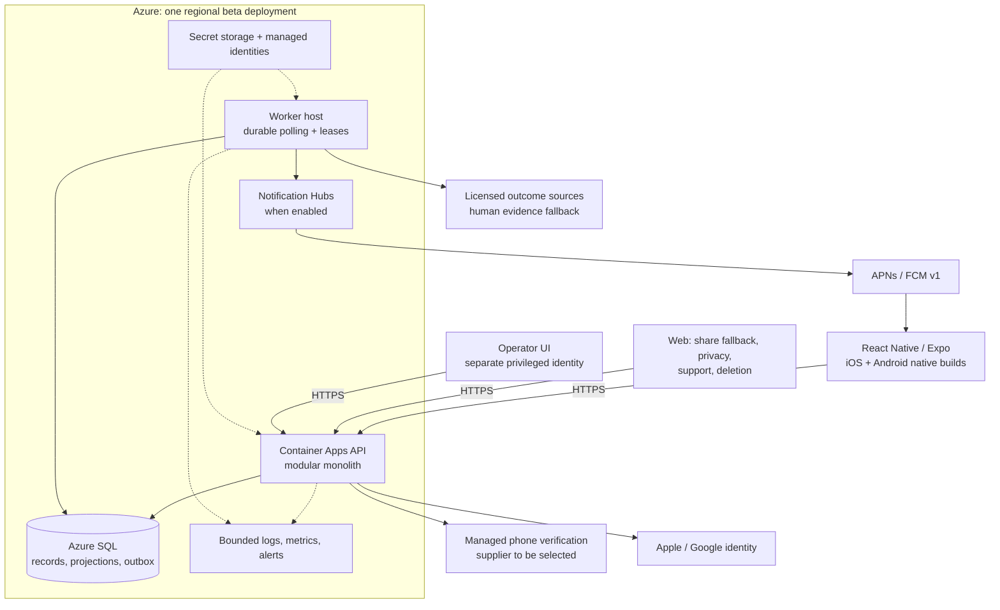

# Called It architecture

Reassessed 2026-10-07. This is the **target design and migration direction**, not a
claim that every component below exists. See [decisions and evidence](README.md),
[observed risks](trust-and-safety.md), and [delivery gates](delivery-plan.md).

## Architectural decisions

Keep a **.NET modular monolith** and a separate worker entry point. The existing
solution builds, the domain is small, and thousands of daily users do not justify
microservices by default. Split deployments for operational needs, not a promise
to eventually turn every module into a service.

Use **Azure SQL as the system of record and initial leaderboard read store**.
Keep authoritative choices, scores, work scheduling and identity ownership durable.
Add a cache only after profiling; Redis must be rebuildable and may never decide
whether a late pick or duplicate reward is valid.

The approved client is **React Native/Expo**, with native development/release
builds for Apple/Google login, secure storage, attestation and APNs/FCM. Expo Go
and browser previews are not substitutes for native integration validation.

The outbox, leased jobs, complete operator UI, new verification supplier and
shipping mobile client are **planned**, not established by this diagram.

## Module ownership

| Module | Owns | Boundary |
| --- | --- | --- |
| Identity | User, linked identities, verification transactions, sessions, account lifecycle | Returns a stable user ID; phone/social details never become leaderboard identifiers. |
| Competition | Question revisions, approvals, rounds, eligibility, accepted choice revisions | Authoritative time, content and concurrency checks. |
| Resolution | Provider adapters, typed rules, evidence, result revisions, disputes | A provider proposes evidence; validated/audited transitions own the result. |
| Progression | Category streaks, lifetime/season scores, achievements, projection versions | Deterministic replay; immutable input revisions and explicit corrections. |
| Social | Friend edges, blocks, invitations, leagues, reports | Checks membership/consent; no implicit access from knowing a phone. |
| Notifications | Preferences, installations, intents, delivery attempts | At-least-once work, expiry and suppression; no game-authority role. |
| Operations | Publication tools, audit, retention, kill switches, migration/recovery | Separate least-privilege operator authorization. |

Keep domain calculations pure and infrastructure behind typed ports. Do not build
an abstract event platform, multiple databases, or an analytics lake before a
working daily loop and operator workflow exist.

## Authoritative persistence

Retain existing User, Question, DailySet, Guess, Streak and Score concepts, but
extend deliberately rather than assume the current schema enforces the rules.

| Record/invariant | Target enforcement |
| --- | --- |
| Competition round | Unique competition/drop identity; immutable published question membership, drop and lock; explicit canceled/final states. |
| Question | Versioned wording/rule/evidence metadata; safe information cutoff distinct from expected resolution time; question cannot be reused accidentally. |
| Eligibility | First eligible round/account activation policy, not a `CreatedAt <= DropAt` approximation that excludes legitimate newcomers. |
| Accepted choices | User/round/question uniqueness, optimistic version, database acceptance time, request idempotency key and payload fingerprint. |
| Result revision | Immutable history, current version, actor/source/evidence/reason and correction status. |
| Projections | User/category/season scores, current/best streaks and achievement receipts with input/checkpoint version. |
| Work | Outbox/job identity, next attempt, lease owner/expiry, fencing/version, attempts and terminal/dead-letter state. |
| Notification | Preference and installation ownership, deduplication scope, TTL, dispatch outcome distinct from handset receipt. |
| Privacy | Erasure/tombstone records, retention classification and audit suitable for restoration/reconciliation. |

Add unique constraints, foreign keys, checks and indexes for the real invariants.
Check SQL Server cascade/index behavior and datetime/concurrency semantics
explicitly; SQLite tests alone cannot validate production correctness.

## Publication and acceptance

Prebuild and review rounds before drop. Publishing a round is a transaction:
validate category completeness, question eligibility and future event cutoffs,
fix membership/revisions, and persist a publication outbox event. Serving the
round is gated by database time, so a delayed notification or worker cannot open
it early or extend the lock.

Target an atomic submit/edit command for the three choices, with a stable request
ID, expected accepted revision, round ID and explicit A/B/Skip entries. Validate
authenticated ownership, account eligibility, round state, question membership,
valid enum values and cutoff in the **same authoritative write transaction**.
Use a database-side conditional write/serialization strategy with concurrency
tests, not an application-clock check followed later by an unconditional save.

A retry with the same request ID and payload returns the original receipt. Reusing
it for different choices is a conflict. A stale revision is a conflict, not
last-writer-wins from a delayed device. A post-lock request without a previous
receipt fails even if the client claims it was sent earlier.

Document the database acceptance point precisely: queues and client send times
do not establish eligibility. Exercise transactions that stall across the lock;
select the SQL isolation/locking strategy based on those tests. Do not promise
zero-boundary races from unit tests of `IsOpenAt` alone.

## Durable scheduling and progression

Do not depend on an in-memory timer reaching the next UTC instant. Workers poll
persisted due work, claim bounded batches with leases, recover expired claims, and
use unique keys plus fencing to prevent a stale worker overwriting newer work.
One configured worker replica is a cost choice, not a correctness guarantee:
deployments/restarts can still overlap executions.

Resolution commits result revision, audit/evidence and outbox work atomically.
Scoring consumes that revision idempotently and advances checkpoints/projections
transactionally. A crash after result commit is recoverable because the work
still exists. Retry transient failures with bounded backoff; surface unknown
providers/permanent failures instead of silently skipping them.

Incremental updates handle ordinary rounds. Corrections replay only the affected
user/category range from a preceding checkpoint, publish a consistent projection
generation, and restate dependent achievements/notifications. Preserve a full
replay path for reconciliation. Do not synchronously load every user's entire
history inside an administrator's HTTP outcome request.

Maintain chronological streak finality through pending earlier results. Distinguish
settled totals, provisional new points and blocked streak calculations. A shared
projection version/as-of marker makes lag visible to clients and operators.

## Leaderboards and public reads

Start with indexed SQL score/streak projection queries, bounded top pages and a
personal/around-me lookup. Filter friends or league membership server-side.
Keep phone/social identifiers out of responses and apply deletion/block rules.

Preserve the existing API shape in the first foundation slice where practical;
season qualification, shared tied ranks, cursor/as-of versions and around-me
responses need an explicit contract revision. Choose deterministic display order,
bounded counts and failure responses rather than relying on differing
Redis/in-memory tie behavior.

At higher measured read volume, add short-lived public-board caching keyed by
projection version; do not publicly cache personalized Today or friend boards.
Cache failure degrades a read path, not accepted choices or result durability.

## Identity and mobile contract

Mandatory phone plus Apple/Google remains an owner constraint. Use a managed
verification port for challenge start/verification, strict provider token
validation, unique identity ownership and explicit linking/recovery flows.
Social token audience/issuer/subject/expiry/nonce are never optional in production.

App-issued sessions need atomic refresh rotation, family replay revocation,
per-device management and recent-authentication for destructive/account changes.
Separate the operator identity plane from consumer phone bootstrap. See the
[trust model](trust-and-safety.md) for controls and retention.

Treat `clients/shared/openapi.yaml` as an **existing prototype contract**, not
automatically a complete source of truth. Add CI generation/drift checks against
the API, typed client generation and structured versioned error codes. Support
an overlap period for released mobile clients; an app-store rollout is not atomic.

Responses should carry server time, accepted revision/receipt, pending/final
status, and actionable error codes. Authenticate deep-link actions again. Use
single-flight refresh in the client; ambiguous network failures retain a draft
and reconcile through idempotency rather than fabricate a successful save.

## Delivery, configuration, and evolution

Separate local Development behavior from every deployed environment, including
an Azure environment named "dev." Production-like configuration must fail closed:
no known signing key, fake social validator, logged OTP, silent push fallback,
or process-local authoritative leaderboard.

Separate resource bootstrap, image build, database migration/seed, app deployment
and readiness verification. Deploy immutable image references; never converge an
existing app back to hello-world. Apply backward-compatible expand/contract schema
changes with a migrator identity, not API-startup DDL. Old/new revisions must
coexist during rollback and mobile-version overlap.

Use liveness for process health and readiness for the ability to serve the
critical database-backed path. External push/SMS outages should be explicit
feature failures, not hide database failure or necessarily take healthy gameplay
offline. Define configuration validation and each readiness dependency separately.

Defer microservices, Service Bus, Event Grid, Redis, AI question generation and
multi-region writes. Introduce them only with an observed bottleneck or operational
requirement and a migration/recovery plan. At this scale, correct transactions,
good indexes, bounded work and a reliable content calendar matter more.
